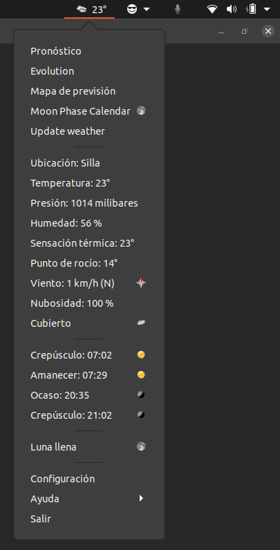
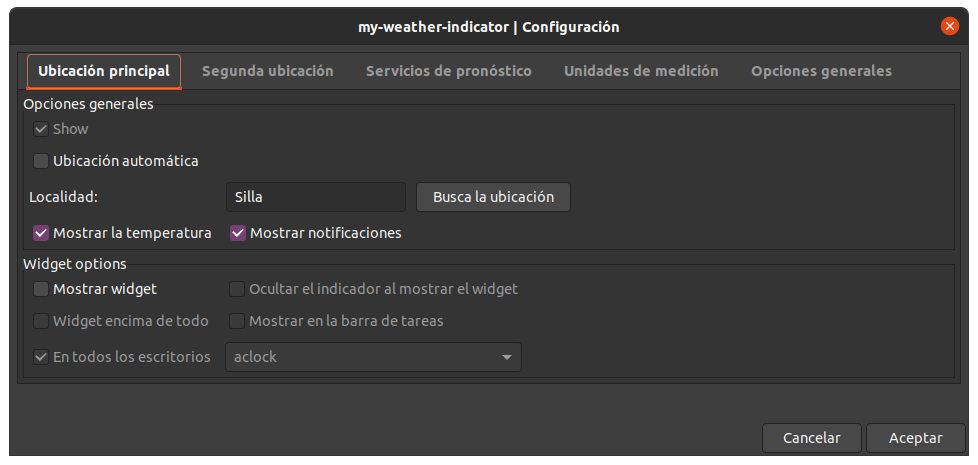
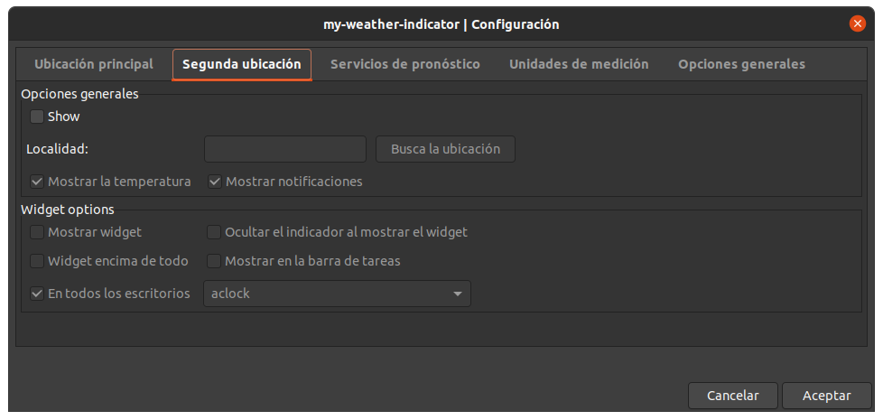
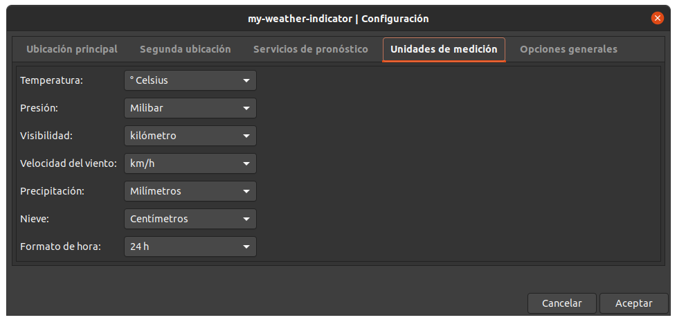
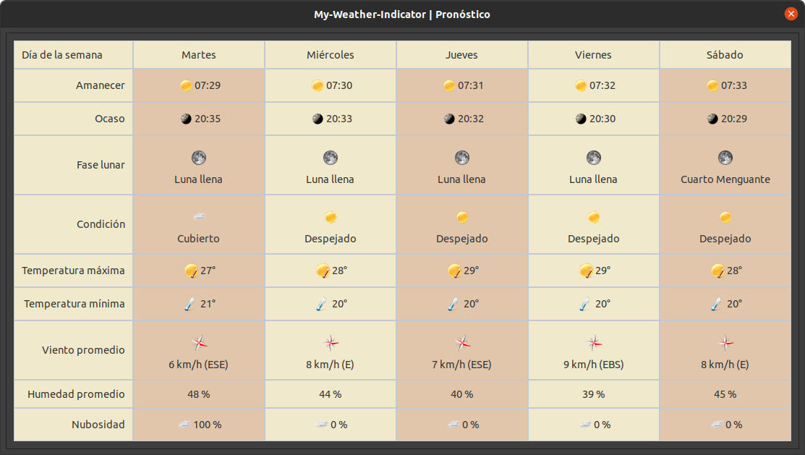
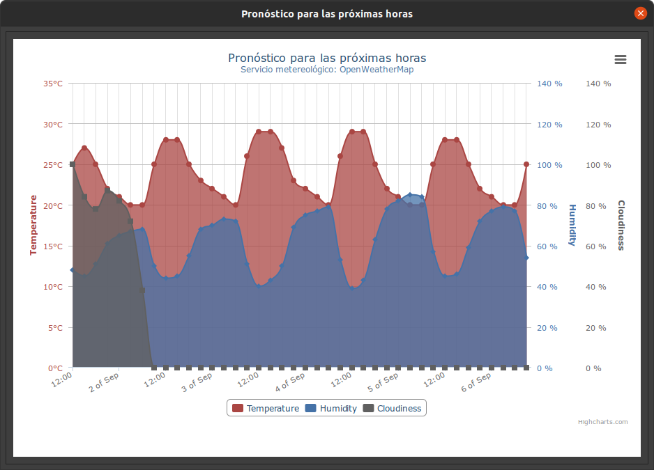
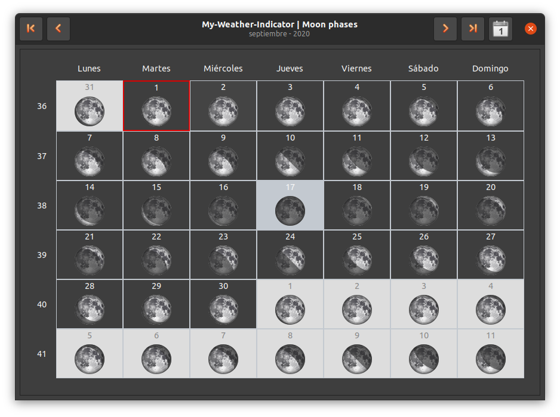

<!-- start project-info -->
<!--
project_title: My Weather Indicator
github_project: https://github.com/atareao/my-weather-indicator/
license: MIT
icon: /datos/Sync/Programacion/Python/my-weather-indicator/data/images/mwi_128.png
homepage: https://www.atareao.es/aplicacion/my-weather-indicator-para-ubuntu/
license-badge: True
contributors-badge: True
lastcommit-badge: True
codefactor-badge: True
--->

<!-- end project-info -->

<!-- start badges -->


[](https://www.codefactor.io/repository/github/atareao/my-weather-indicator)
[](https://app.codacy.com/gh/atareao/my-weather-indicator/dashboard?utm_source=gh&utm_medium=referral&utm_content=&utm_campaign=Badge_grade)
<!-- end badges -->

<!-- start description -->
<h1 align="center">Welcome to <span id="project_title">My Weather Indicator</span> 👋</h1>
<p>
<a href="https://www.atareao.es/aplicacion/my-weather-indicator-para-ubuntu/" id="homepage" rel="nofollow">

</a>
</p>
<h2>🏠 <a href="https://www.atareao.es/aplicacion/my-weather-indicator-para-ubuntu/" id="homepage">Homepage</a></h2>
<p><span id="project_title">My Weather Indicator</span> is an an application especially designed for Ubuntu you will be informed of current weather and the weather forecast. Integrated with the Ubuntu desktop via an indicator. With local maps showing the conditions in nearby towns. The weather forecast for the next few days in your city. You can have up to two indicators for two cities, and choose the best weather service information that you provide. You select customizable widgets to make your desktop more personalized.</p>

<!-- end description -->

<!-- start prerequisites -->
## Prerequisites

Before you begin, ensure you have met the following requirements:

* If you install it from PPA don't worry about, because all the requirements are included in the package
* If you clone the repository, you need, at least, these dependencies,

```
gir1.2-gtk-3.0
gir1.2-glib-2.0
gir1.2-gdkpixbuf-2.0
gir1.2-appindicator3-0.1
gir1.2-notify-0.7
gir1.2-webkit2-4.0
python3-tz
python3-tzlocal
python3-cairo
python3-lxml
python3-dateutil
python3-requests
python3-requests-oauthlib
```

<!-- end prerequisites -->

<!-- start installing -->
## Installing <span id="project_title">My Weather Indicator</span>

To install <span id="project_title">My Weather Indicator</span>, follow these steps:

* In a terminal (`Ctrl+Alt+T`), run these commands

```
sudo add-apt-repository ppa:atareao/atareao
sudo apt update
sudo apt install my-weather-indicator
```

<!-- end installing -->

<!-- start using -->
## Using <span id="project_title">My Weather Indicator</span>

When you start **<span id="project_title">My Weather Indicator</span>** it goes to Indicator Area, as you can see in the next screenshot,



In this screenshot, the language is Spanish, but, if there is no translation for your language, you will find the app in English.

My-Weather-Indicator comes with a complete configuration dialog. You can set two locations for the wheater. In the **Main location** tab, you can set following options,



As for the second location,



It's possible to choose the unit for temperature, pressure, and so on.



You can see forecast,



The evolution of the temperature and pressure



And a Moon calendar




<!-- end using -->

<!-- start contributing -->
## Contributing to <span id="project_title">My Weather Indicator</span>

To contribute to **<span id="project_title">My Weather Indicator</span>**, follow these steps:

1. Fork this repository.
2. Create a branch: `git checkout -b <branch_name>`.
3. Make your changes and commit them: `git commit -m '<commit_message>'`
4. Push to the original branch: `git push origin atareao/readmemaker`
5. Create the pull request.

Alternatively see the GitHub documentation on [creating a pull request](https://help.github.com/en/github/collaborating-with-issues-and-pull-requests/creating-a-pull-request).
</commit_message></branch_name>

<!-- end contributing -->

<!-- start contributors -->
## 👤 Contributors ✨

Thanks goes to these wonderful people ([emoji key](https://allcontributors.org/docs/en/emoji-key)):

<!-- end contributors -->

<!-- start table-contributors -->

<table id="contributors">
	<tr id="info_avatar">
		<td id="acdcfanbill" align="center">
			<a href="https://github.com/acdcfanbill">
				
			</a>
		</td>
		<td id="atareao" align="center">
			<a href="https://github.com/atareao">
				
			</a>
		</td>
		<td id="jalakas" align="center">
			<a href="https://github.com/Jalakas">
				
			</a>
		</td>
		<td id="vpaslavskyi" align="center">
			<a href="https://github.com/vpaslavskyi">
				
			</a>
		</td>
	</tr>
	<tr id="info_name">
		<td id="acdcfanbill" align="center">
			<a href="https://github.com/acdcfanbill">
				<strong>acdcfanbill</strong>
			</a>
		</td>
		<td id="atareao" align="center">
			<a href="https://github.com/atareao">
				<strong>Lorenzo Carbonell</strong>
			</a>
		</td>
		<td id="jalakas" align="center">
			<a href="https://github.com/Jalakas">
				<strong>jalakas</strong>
			</a>
		</td>
		<td id="vpaslavskyi" align="center">
			<a href="https://github.com/vpaslavskyi">
				<strong>vpaslavskyi</strong>
			</a>
		</td>
	</tr>
	<tr id="info_commit">
		<td id="acdcfanbill" align="center">
			<a href="/commits?author=acdcfanbill">
				<span id="role">💻</span>
			</a>
		</td>
		<td id="atareao" align="center">
			<a href="/commits?author=atareao">
				<span id="role">💻</span>
			</a>
		</td>
		<td id="jalakas" align="center">
			<a href="/commits?author=jalakas">
				<span id="role">💻</span>
			</a>
		</td>
		<td id="vpaslavskyi" align="center">
			<a href="/commits?author=vpaslavskyi">
				<span id="role">🌍</span>
			</a>
		</td>
	</tr>
</table>
<!-- end table-contributors -->
uhm2
